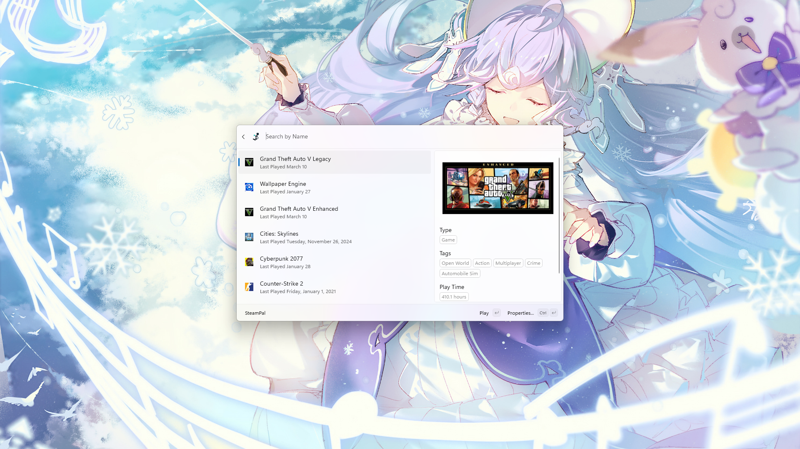

# 

# SteamPal for Command Palette       

[English](../readme.md) | [简体中文](zh_CN.md) | 正體中文

  <strong>ⓘ 資訊</strong>
   
  啟動此擴充功能後，Steam 服務將會立即終止——這意味著當遊戲正在執行時，強烈建議不要啟用或重新載入命令面板（Command Palette）。

  <strong>ⓘ 備註</strong>
   
  SteamPal for Command Palette 透過 TCP 協定使用 Chrome DevTools Protocol 與 Steam CEF 互動並獲取必要資料。請注意，本擴充功能可能與其他採用相同技術的程式發生衝突。若發生衝突，您可以考慮手動設定偵錯連接埠。此外，由於 Steam 服務在 Windows 系統具有高權限層級，若您無法確保系統環境安全無虞，在本機透過 TCP 進行 CEF 偵錯可能使您的帳戶面臨遭到入侵的風險（我們曾嘗試實作管道通訊偵錯，但 steamwebhelper 似乎無法支援，此功能或將於未來實現）。

  <strong>ⓘ 重要事項</strong>
   
  因上游程式錯誤（<a style="color: lightblue;" href="https://github.com/microsoft/PowerToys/issues/39837">microsoft/PowerToys#39837</a>），您可能會觀察到使用此擴充功能時出現記憶體洩漏現象。對此問題，我們目前無能為力。

 

SteamPal 是一款 Powertoys 命令面板擴充功能，讓您能直接透過命令面板快速搜尋、啟動及管理 Steam 遊戲與應用程式。本擴充功能運用 Steam 用戶端的偵錯介面，即時取得已安裝遊戲資訊、遊玩時數，並可透過單一指令啟動遊戲。

## 目錄

- [功能特色](#功能特色)
- [安裝指南](#安裝指南)
  - [原始碼安裝（開發模式）](#原始碼安裝開發模式)
- [使用教學](#使用教學)
  - [搜尋遊戲](#搜尋遊戲)
  - [啟動遊戲](#啟動遊戲)
  - [存取遊戲屬性](#存取遊戲屬性)
  - [搜尋 Steam 商店](#搜尋-steam-商店)
- [設定選項](#設定選項)
- [貢獻指南](#貢獻指南)
- [授權條款](#授權條款)

## 功能特色

- **Steam 遊戲快速搜尋**：在命令面板輸入名稱，即刻搜尋 Steam 遊戲庫中的遊戲。
- **一鍵啟動遊戲**：直接從搜尋結果啟動已安裝的 Steam 遊戲。
- **檢視遊戲詳情**：顯示重要遊戲資訊，包含遊玩時數、最後啟動時間及遊戲類型。
- **存取遊戲屬性**：為選定遊戲開啟 Steam 遊戲屬性對話框。
- **Steam 商店搜尋**：若遊戲未存在於您的收藏庫，可快速於 Steam 商店搜尋。
- **即時數據更新**：運用 Steam 用戶端偵錯介面取得最新遊戲資訊。

## 安裝指南

### 原始碼安裝（開發模式）

若需設定 SteamCmdPalExtension 開發環境或直接執行原始碼：

... 安裝步驟

## 使用教學

擴充功能安裝完成後，開啟 Powertoys 命令面板（預設快捷鍵：`Win` + `Alt` + `Space`）。

### 搜尋遊戲

於命令面板輸入「SteamPal」後按 `Enter` 開啟擴充功能頁面。接著輸入欲搜尋的遊戲名稱，清單將即時篩選結果。

### 啟動遊戲

從搜尋結果選取已安裝遊戲，按下 `Enter`（或雙擊滑鼠）即可透過 Steam 啟動遊戲。

### 存取遊戲屬性

在搜尋結果中選取遊戲後，可存取其屬性設定。按下 `Ctrl + Enter` 或點選項目關聯指令，即可開啟 Steam 遊戲屬性面板。

### 搜尋 Steam 商店

若搜尋結果未顯示本地收藏庫遊戲，清單底部將出現「在 Steam 搜尋」指令。選取此指令將透過預設瀏覽器開啟 Steam 商店進行搜尋。

## 設定選項

透過命令面板的設定介面可調整以下參數：

- **最大顯示結果數**：設定搜尋結果顯示上限（建議值：低於 50 項以維持最佳效能）。
- **（選填）偵錯埠**：指定 Steam CEF 偵錯埠，留空則自動分配動態埠。

## 貢獻指南

誠摯歡迎貢獻！若發現程式錯誤或功能需求，請於 GitHub 儲存庫提交 issue。歡迎 PR 。

## 授權條款

本專案採用 MIT 授權條款釋出。